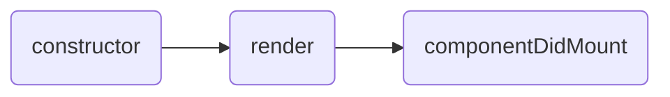
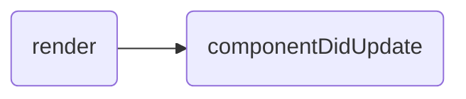
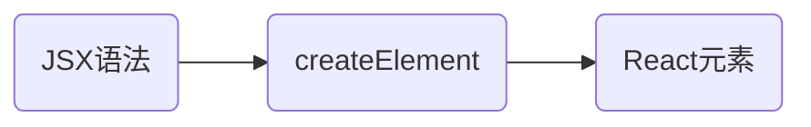

🎉 希望可以记录一些笔记，保持原有久笔记的前提下动态更新，方便对比复习

👉 值得学习的 <a href="https://react.dev/learn/thinking-in-react">Thinking In React</a>

<!-- more -->

# 前言

🙃 记录时间、版本的不同，代码风格会不同，最新的版本示例会是最上面一个然后用 `新---` 和 `旧---` 标识

`TBR` 标出的，是没看明白，还需细品的 😅

# 基本使用

## 安装

### 使用 vite

<a href="https://vitejs.dev/guide/">🌎 Getting Start</a>

先创建 `vite` 再选择 `react`

```shell
npm create vite@latest
```

直接指定 `react`

```shell
npm create vite@latest my-react-app -- --template react

# yarn
yarn create vite my-react-app --template react

# pnpm
pnpm create vite my-react-app --template react
```

- 或者是 `react-ts`

### 非脚手架

```shell
npm install react react-dom
```

通过`<script>`导入，注意导入顺序

```html
<div id="root"></div>

<script src="./node_modules/react/umd/react.development.js"></script>
<script src="./node_modules/react-dom/umd/react-dom.development.js"></script>

<script>
  /*	创建react元素（了解）
		- 参数一：元素名称
		- 参数二：元素属性，是对象
		- 参数三：元素的子节点（从这个参数开始，之后添加的参数都是子节点）
	*/
  const title = React.createElement("h1", null, "hello react!");
  /*	渲染react元素
    	- 参数一：要渲染的元素
    	- 参数二：挂载点
    */
  ReactDOM.render(title, document.getElementById("root"));
</script>
```

### 脚手架

`React.createElement()`和`createRoot()`的区别

- 前者：创建 React Element
- 后者：创建一个 root-level 的容器来渲染 React 程序 `React 18`

#### React 18 以前

下载

```shell
# 推荐
npx create-react-app myReact

## 不太推荐
npm init react-app myReact
yarn create react-app myReact
```

启动（要进入项目的根目录）

```shell
npm start
```

使用，通过 ES6 的 `import` 关键字

```js
import React from "react";
import React from "react-dom";

// 创建react元素
const title = React.createElement("h1", null, "hello react!");

// 渲染元素
ReactDOM.render(title, document.getElementById("root"));
```

#### React 18 以后

```shell
npm install react react-dom
```

```js
import { createRoot } from "react-dom/client";

// 清空现有的HTML内容
document.body.innerHTML = '<div id="app"></div>';

// 使用React组件取而代之
const root = createRoot(document.getElementById("app"));
root.render(<h1>Hello, world</h1>);
```

或者是并不想清空当前 HTML 页面的内容，那就找一个元素当作容器来渲染当前的 React 组件

```html
<!DOCTYPE html>
<html>
  <head>
    <title>My app</title>
  </head>
  <body>
    <p>This paragraph is a part of HTML.</p>
    <nav id="navigation"></nav>
    <p>This paragraph is also a part of HTML.</p>
  </body>
</html>
```

```js
import { createRoot } from "react-dom/client";

function NavigationBar() {
  // TODO: Actually implement a navigation bar
  return <h1>Hello from React!</h1>;
}

const domNode = document.getElementById("navigation");
const root = createRoot(domNode);
root.render(<NavigationBar />);
```

## React 和 JSX

`jsx` 是 `JavaScript XML` 的简写，在 JavaScript 文件中写 HTML-like 标签

- 因为`jsx`不是标准的`ECMAScript`语法，而是它的语法扩展，所以在普通环境是不可以使用的；要在脚手架中使用（因为脚手架中包含了`babel`，@babel/preset-react）

> JSX 和 React 是两个东西，前者是语法拓展，后者是一个 JavaScript 库。React 是使用了这种语法拓展。通常是一起使用的，但也可以分开使用。<a href="https://legacy.reactjs.org/blog/2020/09/22/introducing-the-new-jsx-transform.html#whats-a-jsx-transform">更多介绍</a>

### 语法规则

**1. 单根节点**

> 原因：JSX 看起来像 HTML，但是是转换成原生的 JavaScript 对象，一个方法是不可以返回两个对象的，所以才需要包裹起来

```jsx
<div>
  <p>123</p>
  <p>456</p>
</div>
// 或者空白的
<>
  <p>123</p>
  <p>456</p>
</>
```

- 这个空白的标签叫做 Fragment （片段 ？？）
- 完整样子：`<Fragment></Fragment>`
- 向 Fragment 传 _key_，不能使用短标签 `<></>`，需要从 react 导入 Fragment 然后 s 使用`<Fragment key={yourKey}>...</Fragment>`
- 不会重置`state`，在从`<><Child /></>`到`[<Child>]`或反转的时候；`<><><Child /></></>`就会重置。关于重置 state，需要跳转看到`state`章节

```jsx
import React from "react";
import React from "react-dom";

// 创建react元素
const title = (
  <h1 className="title">
    Hello Hi <span />
  </h1>
);

// 渲染元素
ReactDOM.render(title, document.getElementById("root"));
```

- class => className 、for => htmlFor，等等
- 如果元素没有子节点，可以转为单标签：`<span></span>` => `<span />`，当然不转也行

**2. 必须要关闭标签**

...其实一直不知道标签还可以不用关闭的 🥲

```
<ul>
  <li>12
  <li>34
  <li>56
</ul>


```

```html
<ul>
  <li>12</li>
  <li>34</li>
  <li>56</li>
</ul>


```

**3. 驼峰式属性名**

因为 JSX 要转换成 JavaScript 对象，所以，例如 HTML-like 中的样式类`class`改成了`className`，不然得和 JavaScript 类的关键字冲突

DOM 节点的`className`属性也是这个意思，避免与操作 DOM 的编程语言保留的`class`关键字冲突

> 对于样式类，class 是属于 HTML 的，而 className 是 DOM 属性

<a href="https://react.dev/reference/react-dom/components/common">👉 这里查看所有的属性名</a>

> 由于历史原因`aria-*` 和 `data-*` 依然使用 `-` 而不是驼峰式。主要原因有 W3C 定的一些 HTML 规范，然后 React 也遵循这些规范以适配很多库、开发工具、不同技术等等

- aria 规范: Accessible Rich Internet Applications，提供一组属性增强 web 应用程序的可访问性。

### 使用 js 表达式 (JSX 的花括号)

> ❗ 花括号外面是不需要加 双引号或者单引号 的；花括号里面如果是字符串 <br /> return 语句中 JS 表达式要写在花括号里面

```js
export default function Avatar() {
  const avatar = "https://i.imgur.com/7vQD0fPs.jpg";
  const description = "Gregorio Y. Zara";
  return ;
}
```

```jsx
const name = "Jerry"; // 使用一个花括号，注意是一个
const title = <h1>{name}</h1>;
ReactDOM.render(title, document.getElementById("root"));
```

在`{}`中可以使用任意的合法的`JavaScript`表达式，不过也有例外

```jsx
const hello = () => "hello";
const myDiv = <div>我是一个div</div>;

const title = (
  <div>
    <p>{1 + 1}</p>
    <p>{1 < 2 ? "对呀" : "不对"}</p>
    <p>{hello()}</p>
    {div}
  </div>
);
ReactDOM.render(title, document.getElementById("root"));
```

- jsx 自身也是表达式，所以`{div}`也适用
- `<p>{ {a: "我是a"} }</p>`，这种对象是**不行**的，但是在`style`样式中又可以使用
- 在里面使用语句也是**不行**的：if、for 这些

**JSX 使用两个花括号的场景**

- CSS：`<ul style={{backgroundColor: 'black', color: 'pink'}}>`
  - css 属性名要驼峰式
- JSX 传递对象：`person={{ name: "Hedy Lamarr", inventions: 5 }}`

### 条件渲染

```js
function Item({ name, isPacked }) {
  return <li className="item">{isPacked ? name + "✔" : name}</li>;
}

export default function Pane() {
  return (
    <div>
      <Item name="mike" isPacked={false}></Item>
      <Item name="amy" isPacked={true}></Item>
    </div>
  );
}
```

- 如果不渲染东西，可以返回`null`。**一般不会这样做**

使用逻辑与简化条件判断

```js
return (
  <li className="item">
    {name} {isPacked && "✔"}
  </li>
);
```

- React considers `false` as a “hole” in the JSX tree，像`undefined`和`null`一样不渲染东西
- 可用多个花括号

> 注意 `&&` 左边有数字，因为如果是 _0_ 的话，会被认为是`false`；可以加个前提判断当左边大于 _0_

如果要简化返回语句，或者有个默认返回，可以使用结合使用**变量和 JSX**

```js
function Item({ name, isPacked }) {
  let content = name;
  if (isPacked) {
    // 多行要使用括号
    content = <del>{name + "✔"}</del>;
  }
  return <li className="item">{content}</li>;
}
```

### 列表渲染

> 箭头函数`=>`后面隐式返回，不用加上`return`，但是只返回一行；返回多行`=>`需要加上`{}`和`return`

如果要渲染一组数据，应该使用数组的`map()`方法

```js
const songs = [
  { id: 1, name: "我很快乐" },
  { id: 2, name: "你很快乐" },
  { id: 3, name: "他很快乐" },
];

export default function SongList() {
  // 决定列表结构（每一项遍历需要有一个key）
  const songItems = songs.map(item => <li key={item.id}>{item.name}</li>);
  return <ul>{songItems}</ul>;
}
```

- 一般会用数据库中对应的 ID 作为 key
- 如果是本地数据，可以使用 <a href="https://developer.mozilla.org/en-US/docs/Web/API/Crypto/randomUUID">crypto.randomUUID()</a> 或者是包<a href="https://www.npmjs.com/package/uuid">uuid</a> 生成

> 不要使用`Math.random()`生成 key，key 除了标识当前 DOM，还会有缓存作用，数据不变化的不会重新渲染以使得渲染更快，如果用了随机数，所有的 DOM 都会在数据更新时重新渲染 <br /> key 在`props`是获取不到的

想要渲染多个 DOM 节点但是又不想在外面包一个多余的节点，例如

```js
const listItems = people.map(person => (
  <div key={person.id}>
    <h1>{person.name}</h1>
    <p>{person.bio}</p>
  </div>
));
```

不想，要这个外面的`<div>`，可用`<Fragment>`代替，在 DOM 中 Fragments 不会出现

```js
// 记得要事先导入
import { Fragment } from "react";

const listItems = people.map(person => (
  <Fragment key={person.id}>
    <h1>{person.name}</h1>
    <p>{person.bio}</p>
  </Fragment>
));
```

记得要事先导入：

> 不能使用 `<></>`，因为它不能传递 `key`

### 样式处理

行内样式：style（不推荐），使用样式时可以在`{}`中使用对象

```jsx
const list = (
  <h1 style={{ color: "red", backgroundColor: "yellow" }}>JSX行内样式</h1>
);
```

类名：className

```css
/* index.css */
.title {
  color: "red";
  background-color: "yellow";
}
```

```jsx
import "index.css"const list = ( <h1 className="title">JSX类样式</h1> )
```

> 小结：React 是利用 JavaScript 语言自身来编写界面，而不是像 Vue 一样通过增强 HTML 的功能。

# 组件基础

- 一个页面可以全部都是 React 组件。
- a React component is a JavaScript function that you can sprinkle with markup

## 两种创建方式

> `React 16.8` 以后 推荐创建组件的方法不再是 _类组件_ ，而是 _函数组件_

函数的方式和类的方式

### 函数组件

- 使用`function`关键字
- 函数名称**大写**开头
- 函数组件必须有返回值（返回`null`表示不渲染内容）
  - 返回单行可不需要括号，返回**多行必须括号**
- 不要在组件里面再定义其他组件

```jsx
function Hello() {
  return <div>这是一个函数组件</div>;
}
// 或者const Hello = ()=> <div>这是一个函数组件</div>
// 函数名作为标签名
ReactDOM.render(<Hello />, document.getElementById("root"));
```

```jsx
export default function Profile() {
  return (
    <div>
      
    </div>
  );
}
```

- 虽然里面有*src*、_alt_，但是实则为 JavaScript，这种写法叫
- React 会以大小写来区分 HTML 标签和 React 组件

### 类组件

- 使用`class`关键字
- 类名要大写开头，并且继承于`React.Component`
- 必须有`render()`方法，并且这个方法要有返回值

```jsx
class Hello extends React.Component {
    render (
    	return ( <div>这是一个类组件</div> )
    )
}

ReactDOM.render(<Hello />, document.getElementById("root"))
```

## 组件的导入导出

- 一般会将一个组件放到一个单独的 js 文件中

```js
// 后缀名可省略
import NavMenu from "./navMenu.js";

// 内部使用的话，无需导出
function HeaderTitle() {
  return <h1></h1>;
}

export default function Header() {
  return (
    <div>
      <NavMenu />
      <HeaderTitle />
    </div>
  );
}
```

```js
/* Hello.js */

import React from "react"

class Hello extends React.Component {
    render (
    	return ( <div>这是一个独立文件组件</div> )
    )
}

export default Hello
```

```jsx
/* index.js */

import React from "react";
import React from "react-dom";

import Hello from "./Hello.js";

ReactDOM.render(<Hello />, document.getElementById("root"));
```

### 默认与命名导出导入

- 一个文件只能有一个默认导出

| 语法 | 导出                                  | 导入                                    |
| ---- | ------------------------------------- | --------------------------------------- |
| 默认 | `export default function Button() {}` | `import Button from './Button.js';`     |
| 命名 | `export function Button() {}`         | `import { Button } from './Button.js';` |

- 默认导出，导入的时候，导入名字随便写
- 命名的时候，名字需要对应

虽然默认导出`export default () => {}`没问题，但是不推荐没有名字

## 事件处理

### 基本使用

- `on+事件名称={事件处理程序}`，`onClick={()=>{}}`
- 驼峰式命名

> 事件处理函数必须是**传递**而不是**调用**，就是说不用在函数后面加上括号

给组件添加事件处理：定义一个函数，然后作为*props*传递给`<button>`

- 这个函数一般在当前这个组件里面
- 以`handle`开头：`onClick={handleClick}`, `onMouseEnter={handleMouseEnter}`

```js
export default function Button() {
  function handleClick() {
    alert("You clicked me!");
  }

  return <button onClick={handleClick}>点击</button>;
}
```

```jsx
class Button extends React.Component {
  handleClick() {
    console.log("触发单击事件");
  }
  render() {
    return <button onClick={this.handleClick}>点击</button>;
  }
}
```

#### 事件对象

- 事件处理器会捕获到子组件可能会有的事件：称为冒泡或者传播；在事件发生的地方开始，然后顺着组件树往上传递。比如子组件和父组件都有点击事件。

> 所有事件都会冒泡，除了`onScroll`，只在使用的地方促发

事件处理函数仅有的一个参数就是*事件对象*，一般用`e`来表示

- `e.stopPropagation()` 阻止冒泡
- 父组件添加`onClickCapture={()=>{ /* ... */}}` 捕获子组件事件

```js
// 捕获事件
<div onClickCapture={() => {}}>
  <button onClick={e => e.stopPropagation()} />
  <button onClick={e => e.stopPropagation()} />
</div>
```

```jsx
class Button extends React.Component {
  handleClick(e) {
    // 阻止默认事件
    e.preventDefault();
  }
  render() {
    return (
      <a href="www.baidu.com" onClick={this.handleClick}>
        去百度
      </a>
    );
  }
}
```

### 事件处理函数读取 props 和作为 props 传递

```js
function Button({ onClick, children }) {
  return <button onClick={onClick}>{children}</button>;
}

function PlayButton({ movieName }) {
  // 之所以在这定义事件处理函数，是因为对于<Button>的不同调用有不同的使用场景，所以不把处理函数放<button>里面
  function handlePlayClick() {
    // 直接使用 props
    alert(`Playing ${movieName}!`);
  }
  // 这里的onClick对应的是原生<button>那里的onClick，所示使用了默认名
  return <Button onClick={handlePlayClick}>Play "{movieName}"</Button>;
}

export default function Toolbar() {
  return (
    <div>
      <PlayButton movieName="Kiki's Delivery Service" />
    </div>
  );
}
```

### 自定义事件处理函数 props 名字

- 作为 props 传递时使用的名字
- 上面的`handlePlayClick`作为 props 传递的时候使用的是`onClick`，算是使用了默认名字

一般以`on`开头，然后驼峰式命名

```js
function Button({ onSmash, children }) {
  return <button onClick={onSmash}>{children}</button>;
}

export default function App() {
  return (
    <div>
      <Button onSmash={() => alert("Playing!")}>Play Movie</Button>
      <Button onSmash={() => alert("Uploading!")}>Upload Image</Button>
    </div>
  );
}
```

> 对于原生的 HTML 元素，要尽量使用对应功能的元素其对应的事件。比如点击事件会用到`<button>`而不是`div`

## state

随着时间改变的数据叫 _state_，对于对象和数组，react 推荐它们的使用是不可变的（immutable），要想更新，就创建一个新的

### 有状态和无状态组件

- <del style="color: darkred">无状态组件：函数组件；有状态组件：类组件</del> `React 16.8`
- 状态（state）负责数据
- <del style="color: darkred;">函数组件没状态，可以用于展示数据（静态）</del> `React 16.8`
- 类组件有自己状态，可以用于更新界面（动态）`React 16.8 后不再是主推的`

### state 基本使用(新)

```js
import { useState } from "react";

const [index, setIndex] = useState(0);

// 改变值
function handleClick() {
  setIndex(index + 1);
}
```

- `useState` 返回两个东西通过解构获得，一个是这个值，另一个是更新这个值二点方法
- 名字随便起，但习惯使用 `名字` 和 `set名字`
- 每个组件里的 state 都是独立的

> `use`开头的*Hooks*方法，只可在组件的**top level**执行，不可再条件判断、列表循环中使用

#### 更改 _对象_ 类型的 state

直接更新对象里的属性是不会触发页面更新的

```js
const [position, setPosition] = useState({ x: 0, y: 0 });

// ..

position.x = e.clientX;
position.y = e.clientY;
```

虽然在某些情况这样做会有效，但是并不推荐。所以要使用`setPosition`传递一个新的对象过去，然后组件重新渲染

重点是使用`setXXX`这个函数，不管要更新的值以什么形式变化，比如

```js
const nextPosition = {};

nextPosition.x = e.clientX;
nextPosition.y = e.clientY;

setPosition(nextPosition); // 事实上和下面这个相同

setPosition({ x: e.clientX, y: e.clientY });
```

不过这样会有个新的问题，就是只是想要改变某一个属性的值，不想要改变其他值。

- 如果重新将整个对象传一次，属性多了会很麻烦

使用展开运算符将不需要改变的对象属性复制到新的对象

```js
// 如果只需要改变 firstName，这样太麻烦了
setPerson({
  firstName: e.target.value,
  lastName: person.lastName,
  email: person.email,
});

// 这样优化
setPerson({
  ...person, // 复制旧的值
  firstName: e.target.value, // 仅重写 firstName
});
```

展开运算符仅在对象的第一层起作用，如果要复制更深层的，得多次使用展开运算符

```js
const [person, setPerson] = useState({
  name: "Niki de Saint Phalle",
  artwork: {
    title: "Blue Nana",
    city: "Hamburg",
    image: "https://i.imgur.com/Sd1AgUOm.jpg",
  },
});
```

- 只想要更新 _artwork_ 的 _city_

```js
const nextArtwork = { ...person.artwork, city: "New Delhi" };
const nextPerson = { ...person, artwork: nextArtwork };
setPerson(nextPerson);

// 或者直接在里面
setPerson({
  ...person, // Copy other fields
  artwork: {
    // but replace the artwork
    ...person.artwork, // with the same one
    city: "New Delhi", // but in New Delhi!
  },
});
```

❔ 其他情况：更改 `obj3.artwork`，`obj1` 和 `obj2.artwork` 也会改变，因为它们是相同的对象

```js
let obj1 = {
  title: "Blue Nana",
  city: "Hamburg",
  image: "https://i.imgur.com/Sd1AgUOm.jpg",
};

let obj2 = {
  name: "Niki de Saint Phalle",
  artwork: obj1,
};

let obj3 = {
  name: "Copycat",
  artwork: obj1,
};
```

#### 更新 _数组_ 类型的 state

- 同样推荐不可变（immutable），所以不要使用`arr[0] = "qaq"`来修改其中的值
- 同样也不推荐使用`pop()`、`push()`等方法来改变它
- 推荐从旧数组的基础上创建新的数组，并且使用不会改变旧数组的数组方法，例如`filter()`、`map()`

React 中 state 中数组的操作方法推荐（避免使用该百年数组的，推荐使用返回新数组的）：

|      | 避免               | 推荐             |
| ---- | ------------------ | ---------------- |
| 添加 | push, unshift      | concat, [...arr] |
| 删除 | pop, shift, splice | filter, slice    |
| 替换 | splice, arr[i]=xx  | map              |
| 排序 | reverse, sort      | 先复制这个数组   |

**添加内容**：和对象一样，使用扩展运算符来复制以达到改变某一个值的目的

```js
const [artists, setArtists] = useState([]);

setArtists(
  // Replace the state
  [
    // with a new array
    ...artists, // that contains all the old items
    { id: nextId++, name: name }, // and one new item at the end
  ]
);
```

- 要改变新插入值的位置，将新插入的值这行放到扩展运算的上面就行

**删除内容**：最简单的就是过滤掉这个不需要的，或者直接创建个新数组的不包含这个要删除的内容

**替换内容**：在原有的基础上创建一个新的数组，使用`map`，如果符合，改变这个值然后返回，不符合的返回原来的样子

```js
const [counters, setCounters] = useState([xx, xxx]);

const nextCounters = counters.map((c, i) => {
  if (i === index) {
    // +1
    return c + 1;
  } else {
    // 不改变
    return c;
  }
});
setCounters(nextCounters);
```

**插入内容**：确定要添加的位置，然后使用`slice`分割数组，将要添加的放到两个切片中间

```js
const [artists, setArtists] = useState([xxx, xx, x]);
// ...

const insertAt = 1; // 任何要插入的位置
const nextArtists = [
  // 插入点前:
  ...artists.slice(0, insertAt),
  // 要插入的:
  { id: nextId++, name: name },
  // 插入点后:
  ...artists.slice(insertAt),
];
setArtists(nextArtists);
```

**其他操作**：比如 _反转_，_排序_，js 方法会改变旧的数组，所以要先复制出一个数组然后再做出改变，如`nextList.sort()`，`nextList[0] = {name: "zs", age: 18}`

> 对于数组 _list_ 和 _nextList_，虽然不是相同的数组，但是`list[0]`和`nextList[0]`指向的是相同的对象，所以直接`nextList[0].age=19`这样的还是不推荐的，因为这是浅拷贝，是直接改掉了对象里面的东西

**👉 更新数组里面的对象**

对象其实并不是再数组里面的，只是在代码这里看起来是在里面；但事实上当使用数组时（虽然已经使用拓展运算符复制出不同的数组），尝试改变其中数组内元素的值，另外的引用也会跟着改变，因为数组它内容本身还是和旧数组一样，只是在新的数组里面呆着罢了

所以改变数组里面你的对象，可以通过使用`map`找出要改变的对象，然后使用更新对象的方法更新目标对象

### state 基本使用

- 一个对象，是组件内部**私有**的数据，只能在组件内部使用

```jsx
class Hello extends React.component {
  construtor() {
    // ES6 中类的继承中要求要有的，如果有参数就得在其中传递
    super();
    // 初始化state
    this.state = {
      count: 0,
    };
  }
  render() {
    return (
      <div>
        <h1>计数器：{this.state.count}</h1>
        <button
          onClick={() => {
            this.setState({ count: this.state.count + 1 });
          }}
        >
          +1
        </button>
      </div>
    );
  }
}
```

- ❗ 注：不能直接修改 state 中的值：`this.state.count++`，这样是错的

上面的语法有个简化版的，去掉了构造器和 super

```jsx
class Hello extends React.component {
  state = {
    count: 0,
  };
  render() {
    return (
      <div>
        <h1>计数器：{this.state.count}</h1>
      </div>
    );
  }
}
```

### this 指向问题解决 1

- 使用箭头函数解决

```js
class Hello extends React.component {
  construtor() {
    super();
    this.state = { count: 0 };
  }
  // 将事假处理代码抽离出来，会带来this指向问题,使用箭头函数解决
  add() {
    this.setState({
      count: this.state.count + 1,
    });
  }
  render() {
    return (
      <div>
        <h1>计数器：{this.state.count}</h1>
        <button onClick={() => this.add()}>+1</button>
      </div>
    );
  }
}
```

- ❗ 注：在`<button>`中调用时，函数后面**要**加上`()`

### this 指向问题解决 2

- 利用 ES5 中的`bind`方法绑定 this

```jsx
class Hello extends React.component {
  construtor() {
    super();
    // 将事假处理代码抽离出来，会带来this指向问题,使用bind()绑定
    this.add = this.add.bind(this);
    this.state = {
      count: 0,
    };
  }
  add() {
    this.setState({
      count: this.state.count + 1,
    });
  }
  render() {
    return (
      <div>
        <h1>计数器：{this.state.count}</h1>
        <button onClick={this.add}>+1</button>
      </div>
    );
  }
}
```

- ❗ 注：在`<button>`中调用时，这里已经不是函数调用，所以函数后面**不用**加上`()`

### this 指向问题解决 3

基于上面的内容，只需要修改`add()`

```jsx
add = () => {
  this.setState({
    count: this.state.count + 1,
  });
};
```

- 这是实验性语法，但是在`babel`中使用不必担心

## 表单处理

### 受控组件

- HTML 中的状态（数据）是元素自己控制的，但是在 React 中要在 state 中，并且只能通过 setState 来修改
- 解决这个冲突，React 将`state`和元素的`value`绑定在一起
- 受控组件，就是其值是受到 React 控制的

```jsx
class App extends React.Component {
  // 为了方便，这里使用简写形式
  state = {
    txt: "",
    city: "gz",
    isCheck: false,
  };
  handleChange = e => {
    this.setState({
      txt: e.target.value,
    });
  };
  handleCity = e => {
    this.setState({
      city: e.target.value,
    });
  };
  handleChecked = e => {
    this.setState({
      isCHecked: e.target.checked,
    });
  };
  render() {
    return (
      <div>
        <input
          type="text"
          value={this.state.txt}
          onChange={this.handleChange}
        />
        <select value={this.state.city} onChange={this.handleCity}>
          <option value="sh">上海</option>
          <option value="bj">北京</option>
          <option value="gz">广州</option>
        </select>
        <input
          type="checkbox"
          checked={this.state.isChecked}
          onChange={this.handleChecked}
        />
      </div>
    );
  }
}
```

🌝 可以对上面的代码进行优化

1. 给表单元素添加`name`属性，用来区分不同的表单元素，名称与对应的`state`相同。
2. 根据表单元素类型获取对应的值。（value、checked）

```jsx
class App extends React.Component {
  state = {
    txt: "",
    city: "gz",
    isCheck: false,
  };
  handleForm = e => {
    // 获取当前DOM对象
    const target = e.target;
    // 根据类型获取值
    const value = target.type === "checkbox" ? target.checked : target.value;
    // 获取name
    const name = target.name;
    // 如果下面的name没有[]，代表的是在state新增一个name属性；使用[]表示修改state对象中对应的值
    this.setState({
      [name]: value,
    });
  };
  render() {
    return (
      <div>
        <input
          type="text"
          name="txt"
          value={this.state.txt}
          onChange={this.handleForm}
        />
        <select name="city" value={this.state.city} onChange={this.handleForm}>
          <option value="sh">上海</option>
          <option value="bj">北京</option>
          <option value="gz">广州</option>
        </select>
        <input
          name="isChecked"
          type="checkbox"
          checked={this.state.isChecked}
          onChange={this.handleForm}
        />
      </div>
    );
  }
}
```

### 非受控组件

> 通过`ref`，使用原生 DOM 来获取表单元素的值

1. 创建一个 ref 对象

```jsx
constructor() {    super()    // this点后面这个名字随便取    this.txtRef = React.createRef()}
```

2. 将创建好的 ref 对象放到目标元素中

```jsx
<input type="text" ref={this.txtRef} />
```

3. 通过 ref 获取到目标元素的值

```jsx
console.log(this.txtRef.current.value);
```

> react 中不推荐直接操作 DOM

## 保持组件整洁

`1：` 组件就像是公式，不会有意料之外的结果，比如

```js
function double(number) {
  return 2 * number;
}
```

- 一直传 2 它一直返回 4；传 4，就返回 8；

`2：` 保持为一个纯函数，只管自己的事，在调用这个组件之前，不会改变存在的变量或对象

❌ 不好的示例：每使用一次组件`guest`的值增加了

```js
let guest = 0;

function Cup() {
  // Bad: changing a preexisting variable!
  guest = guest + 1;
  return <h2>Tea cup for guest #{guest}</h2>;
}

export default function TeaSet() {
  return (
    <>
      <Cup />
      <Cup />
      <Cup />
    </>
  );
}
```

- 正确做法是通过`props将值传进去`
- 或者将数据在`TeaSet`中操作

`3：` "副作用" 不需要保持整洁？

就是一些 事件处理器 不需要 这样，因为渲染的时候它们并没有执行，而是在等时间触发。所以在这可以改变一些用户的输入、响应等

`TBR:` <a href="https://react.dev/learn/keeping-components-pure">Keeping Components Pure</a>

# 组件进阶

## props

- 接收传递给组件的数据
- 传递数据：给组件标签添加属性
- 接收数据：函数组件通过参数`props`接收数据，类组件通过`this.props`接收数据
- `props`只可读

props 是动态的，并不是组件被创建之后就写死了的

- 但是 props 是不可变对象
- 当组件要改变它的 props，首先会向父组件请求所需数据来传递不同的 props
- 旧的 props 被丢弃，随后被 JavaScript 引擎回收这个 props 占的内存

> 不要直接改变 props 的值，需要使用 `set state`

`新---`

```jsx
export default function Profile() {
  return (
    <Avatar person={{ name: "Lin Lanying", imageId: "1bX5QH6" }} size={100} />
  );
}

/*
 * 这里的参数也可以不展开，直接用个对象，效果一样。不过可能通常不需要整个对象
 * 如果解构，不要忘了大括号
 */
function Avatar({ person, size }) {
  return (
    
  );
}

function getImageUrl() {
  // ...
}
```

**指定默认值**

和 js 一样，在参数那指定就行

```js
function Avatar({ person, size = 10 }) {
  // ...
}
```

- 没传递 _size_ 的时候会使用默认值，或者是传递 `size={undefined}`
- `size={null}`或者`size={0}`，不会使用默认值

**更简洁的传递 props**

> 前提是要想好使用场景？比如父组件就是需要解构，那没办法

不简洁的

```js
function Profile({ person, size, isSepia, thickBorder }) {
  return (
    <div className="card">
      <Avatar
        person={person}
        size={size}
        isSepia={isSepia}
        thickBorder={thickBorder}
      />
    </div>
  );
}
```

- 这里父组件接收到的 props 然后又原封不动再写一次传给子组件，有点麻烦

可以这样

```js
function Profile(props) {
  return (
    <div className="card">
      <Avatar {...props} />
    </div>
  );
}
```

`旧---`

函数组件

```jsx
// 2. 接收数据
const Hello = props => {
  // props是一个对象
  return (
    <div>
      <h1>{props.name}</h1>
    </div>
  );
};
// 1. 传递参数
ReactDOM.render(<Hello name="tom" age={10} />, document.getElementById("root"));
```

类组件

```jsx
// 2. 接收数据
class Hello extends React.Component {
  // 如果使用构造器，super的参数必须传props（只针对构造器里面）
  constructor(props) {
    super(props);
  }
  // 上面构造器的super传不传参数，下面的render都可以接收到props
  render() {
    return (
      <div>
        <h1>{this.props.age}</h1>
        {tag}
      </div>
    );
  }
}
// 1. 传递参数
ReactDOM.render(
  <Hello
    name="tom"
    age={10}
    fn={() => {
      console.log("这是一个函数");
    }}
    tag={<p>这是一个p标签</p>}
  />,
  document.getElementById("root")
);
```

> 传递非字符串的内容要使用`{}`包起来

## props 深入

### children 属性

- 传递 JSX 作为子组件

通过`props.children`获得

```js
import Avatar from "./Avatar.js";

function Card({ children }) {
  return <div className="card">{children}</div>;
}

export default function Profile() {
  return (
    <Card>
      <Avatar size={100} />
    </Card>
  );
}
```

```jsx
const App = props => {
  return (
    <div>
      <h1>组件标签子节点</h1>
      {props.children}
    </div>
  );
};
// 正常情况下，props.children 为空
ReactDOM.render(<App />, document.getElementById("root"));

// 加上子节点后，props.children 为：我是子节点
ReactDOM.render(<App>我是子节点</App>, document.getElementById("root"));
```

- 子节点可以为任意的`jsx`表达式、组件、函数
- 如果是函数，直接使用`props.children()`，外面不用加 {}

### props 校验

- 在创建组件的时候就指定`props`的类型或者格式

在使用之前，先安装`prop-types`

```shell
npm install props-types
```

```jsx
import PropTypes from "prop-types";

const App = props => {
  const arr = props.colors;
  const list = arr.map((item, index) => <li>{item}</li>);
};

// 添加校验
App.propTypes = {
  // 规定为数组类型
  colors: PropTypes.array,
};

ReactDOM.render(
  <App colors={["red", "yellow"]} />,
  document.getElementById("root")
);
```

- `PropTypes.`后面的就是约束规则

⚠ 约束规则：

1. 常见的约束类型：array、bool、func、number、object、string
2. React 元素类型：element
3. 必填项：isRequired（在约束规则后点使用）
4. 特定结构的对象：shape({ })
5. ......

```jsx
import PropTypes from "prop-types";

const App = props => {
  return <div></div>;
};

// 添加校验
App.propTypes = {
  a: PropTypes.number,
  fn: PropTypes.func.isRequired,
  tag: PropTypes.element,
  filter: PropTypes.shape({
    area: PropTypes.string,
    price: PropTypes.number,
  }),
};

ReactDOM.render(<App fn={() => {}} />, document.getElementById("root"));
```

### props 默认值

```jsx
// 添加默认值，当组件不传值的时候，会使用这个默认值
App.defaultProps = {
  pageSize: 10,
};
```

## render props

- 用于组件复用
- 复用 state 和操作 state 的方法

### render

> 这个 render 名字是随便取的

使用组件时拿到组件内部的 props，可以给组件提供的一个函数，然后通过函数的参数来获取。`<Mouse render={ (mouse) => {} } />`，然后函数的返回值作为页面要渲染的结构。

```jsx
// 使用图片先要导入
import img from "./image/cat.jpg";

// 当前组件有状态，也有修改状态的方法
class Mouse extends React.Component {
  state = {
    x: 0,
    y: 0,
  };
  // 鼠标移动处理程序
  handleMouseMove = e => {
    this.setState({
      x: e.clientX,
      y: e.clientY,
    });
  };
  // 监听鼠标移动的代码
  componentDidMount() {
    window.addEventListener("mousemove", this.handleMouseMove);
  }
  // this.props.render是在使用<Mouse />的时候传递的。这个render名字是随便的，由<Mouse />调用时提供
  render() {
    return this.props.render(this.state);
  }
}

class App extends React.Component {
  render() {
    reutrn(
      <div>
        <h1>render props 模式</h1>
        <Mouse
          render={mouse => {
            return (
              <p>
                鼠标位置：{mouse.x} {mouse.y}
              </p>
            );
          }}
        />
        {/* 复用一个<Mouse /> */}
        <Mouse
          render={mouse => {
            return (
              
            );
          }}
        />
      </div>
    );
  }
}
```

- 在`class Mouse`中，组件是要返回内容的，但是在复用组件的情况下，`class Mouse`并不知道要返回什么，所以在使用`<Mouse />`时候提供的要渲染的内容，然后在`this.props.render`中接收
- 意思就是声明`<Mouse />`，和使用`<Mouse />`

### children 取代 render

🎡 格式：

```jsx
// ...
// 在 class Mouse中修改
render() {
    return this.props.children(this.state)
}
// 在使用<Mouse />时
// 同样，在使用时参数对应的是状态值，返回值对应的是要渲染的内容
<Mouse>
	{
        mouse => {
            return ( <p>鼠标位置：{mouse.x} {mouse.y}</p> )
        }
    }
</Mouse>
```

### 代码优化

校验

```jsx
Mouse.propTypes = {
  children: Proptypes.func.isRequired,
};
```

移除`mousemove`事件

```jsx
componentWillUnmount() {
    windows.removeEventListener("mousemove", this.handleMouseMove)
}
```

## 组件之间的通讯

### 父组件传给子组件

- 父组件提供要传递的`state`数据
- 子组件标签添加属性，值为`state`中的数据
- 子组件通过`props`接收父组件中传递的数据

```jsx
class Parent extends React.Component {
  constructor() {
    super();
    this.state = {
      lastName: "tom",
    };
  }
  render() {
    return (
      <div>
        父组件：
        <Child name={this.state.lastName} />
      </div>
    );
  }
}
const Child = props => {
  return (
    <div>
      <p>子组件，接收父组件传递的数据。{props.name}</p>
    </div>
  );
};
ReactDOM.render(<Parent />, document.getElementById("root"));
```

### 子组件传给父组件

- 父组件提供回调函数，用来接收数据（**谁要接收数据，谁就提供回调函数**）
- 将改函数作为属性的值，传递给子组件

```jsx
class Parent extends React.Component {
  constructor() {
    super();
    this.state = {
      parentMsg: "",
    };
  }
  getChildMsg = data => {
    console.log("接收子组件传递过来的数据", data);
    this.setState({
      parentMsg: data,
    });
  };
  render() {
    return (
      <div>
        父组件：给子组件提供了函数
        <Child getMsg={this.getChildMsg} />
        {this.state.parentMsg}
      </div>
    );
  }
}

class Child extends React.Component {
  constructor() {
    super();
    this.state = {
      msg: "你好",
    };
  }
  handleClick = () => {
    // 子组件调用父组件提供的回调函数，从而传递内容
    this.props.getMsg(this.state.msg);
  };
  render() {
    return (
      <div>
        子组件：<button onClick={this.handleClick}>给父组件传递数据</button>
      </div>
    );
  }
}
```

### 兄弟组件传值

- 将要共享的数据提升到最近的公共度组件中
- 公共父组件要做的事：提供共享数据、提供操作共享数据的方法
- 要传值的子组件通过`props`接收数据或是接收操作数据的方法

```jsx
class Counter extends React.Component {
  // 提供共享状态
  state = {
    count: 0,
  };
  // 提供修改状态的方法
  add = () => {
    this.setState({
      count: this.state.count + 1,
    });
  };
  render() {
    return (
      <div>
        <Child1 count={this.state.count} />
        <Child2 add={this.add} />
      </div>
    );
  }
}
const Child1 = props => {
  return <h1>计数器：{props.count}</h1>;
};
const Child2 = props => {
  return <button onClick={() => props.add()}>+1</button>;
};

ReactDOM.render(<Counter />, document.getElementById("root"));
```

### Context

1. 使用`React.createContext()`创建`Provider`和`Consumer`两个组件
2. 使用`<Provider>`将父组件包起来
3. 设置`value`属性，表示要传递的值
4. 使用`<Consumer>`组件接收数据

```jsx
const { Provider, Consumer } = React.createContext();

class App extends React.Component {
  render() {
    return (
      <Provider value="pink">
        <div>
          <Node />
        </div>
      </Provider>
    );
  }
}

const Node = props => {
  return (
    <div>
      <SubNode />
    </div>
  );
};

const SubNode = props => {
  return (
    <div>
      <SubNode />
    </div>
  );
};
const Child = props => {
  return (
    <div>
      <Consumer>{data => <span>我是子节点 {data}</span>}</Consumer>
    </div>
  );
};
```

## 组件的生命周期

📚 <a href="https://projects.wojtekmaj.pl/react-lifecycle-methods-diagram/">详细指导</a>

- 组件的生命周期：组件从被创建到挂载到页面中运行，再到组件不用时卸载的过程
- 只有类组件才有生命周期


💤 不常用的生命周期：<a href="https://projects.wojtekmaj.pl/react-lifecycle-methods-diagram/">点我</a>😁

| 创建时                                              | 更新时                                                       | 卸载时               |
| --------------------------------------------------- | ------------------------------------------------------------ | -------------------- |
| constructor、更新 DOM 和 refs 时、componentDidMount | constructor、更新 DOM 和 refs 时、render、componentDidUpdate | componentWillUnmount |

### 创建时

🚲 执行顺序：



| 钩子函数          | 触发时机                    | 作用                                        |
| ----------------- | --------------------------- | ------------------------------------------- |
| constructor       | 创建组件时，最先执行        | 1. 初始化 state、2. 为事件处理程序绑定 this |
| render            | 每次组件渲染都会触发        | 渲染界面（**不能调用`setState()`**）        |
| componentDidMount | 组件挂载（完成 DOM 渲染）后 | 1. 发送网络请求、2. DOM 操作                |

- `componentDidMount`是在`render()`、`constructor()`外面直接函数调用的，是类的一个成员

### 更新时

- 导致组件更新的情况：new props、setState()、forceUpdate()

```jsx
class App extends React.Component {
    constructor(props) {
        super(props)

        this.state = {
            count: 0
        }
    }
    handleClick = () => {
        // 只要调用setState，页面就会重新渲染，就是调用render
        this.setState({
            count: this.state.count + 1
        })
        // 强制更新
        // this.forceUpdate()
    }
    render() {
        console.log("生命周期钩子函数：render")
        return (
        	<div>
            	<Counter count={this.state.count} />
                <button onClick={this.handleClick}>打豆豆</button>
            </div>
        )
    }
}

class Counter extends React.Component {
    render() {
        console.log("子组件---生命周期钩子函数：render")
        return (
        	<h1>统计打豆豆的次数：{this.props.count}</h1>
        )
    }
}

componentDidUpdate(prevProps) {
    // 比较更新前后props是否相同，进而决定要不要重新渲染内容
    // prevProps：上一次props
    // this.props：当前props
    if (prevProps.count !== this.props){
        this.setState({
            // TODO
        })
        }
    console.log("componentDidUpdate")
}
```

🚙 执行顺序：



| 钩子函数           | 触发时机                    | 作用                                                                         |
| ------------------ | --------------------------- | ---------------------------------------------------------------------------- |
| render             | 每次组件渲染都会触发        | 渲染界面                                                                     |
| componentDidUpdate | 组件更新（完成 DOM 渲染）后 | 1. 发送网络请求、2. DOM 操作、**如果要`setState()`，必须放在一个`if`条件中** |

- 如果没有在 if 里面调用，就会造成递归更新（执行太多次后停下来报错）

### 卸载时

| 钩子函数             | 触发时机               | 作用                           |
| -------------------- | ---------------------- | ------------------------------ |
| componentWillUnmount | 组件卸载（从页面消失） | 执行清理工作（如：清理定时器） |

```jsx
<div>
    {
        this.state.count > 3
        ? <span>豆豆被打GG了</span>
        : <Counter count={this.state.count} />
    }
   <button onClick={this.handleClick}>打豆豆</button>
</div>

// .....

componentWillUnmount() {
    console.log("豆豆被GG，我被触发了")
}
```

## 高阶组件

- 也是用于组件的复用，包装组件，增强组件的功能
- `HOC,Higher-Order Component`，是一个函数，接收要包装的组件，返回增强后的组件

```js
const EnhancedComponent = withHOC(WrappedComponent);
```

高阶组件内部创建一个类组件，在这个类组件中提供复用的状态逻辑代码，通过 prop 将复用的状态传递给被包装组件

```jsx
class Mouse extends React.Component {
  render() {
    return <WrappedComponent {...this.state} />;
  }
}
```

### 基本使用

```jsx
// 1. 创建高阶组件，参数要以大写字母开头，因为是要作为被渲染的组件
function withMouse(WrappedComponent) {
  // 2. 该组件提供复用的状态逻辑
  class Mouse extends React.Component {
    // 2.1 鼠标状态
    state = {
      x: 0,
      y: 0,
    };
    // 2.2 控制鼠标状态的逻辑
    componentDidMount() {
      window.addEventListener("mousemove", this.handleMouseMove);
    }
    componentWillUnmount() {
      window.removeEventListener("mousemove", this.handleMouseMove);
    }
    // 3. 渲染组件并且将状态作为参数传递。同样不提供具体界面，在调用的时候提供界面
    render() {
      return <WrappedComponent {...this.state} />;
    }
  }
  return Mouse;
}

// 4. 测试高阶组件
const Position = props => (
  <p>
    鼠标当前位置：( x: {props.x}, y: {props.y} )
  </p>
);
// 测试高阶组件2
const Cat = props => ;
// 5. 获取增强后的组件
const MousePosition = withMouse(Position);
// 获取增强后的组件2
const CatPosition = withMouse(Cat);

class App extends React.Component {
  render() {
    <div>
      {/* 6. 渲染增强后的高阶组件 */}
      <MousePosition />
      <CatPosition />
    </div>;
  }
}
```

### displayName

- 在浏览器的 React 开发者工具中，复用的组件名字显示都是一样的，所以要设置`displayName`，设置不一样的名字，便于调试（React Developer Tools）

```jsx
function withMouse(WrappedComponent) {
  class Mouse extends React.component {
    // ...
  }
  // 设置displayName
  Mouse.displayName = ` WithMouse${getDisplayName(WrappedComponent)} `;
  return Mouse;
}

function getDisplayName(WrappedComponent) {
  return WrappedComponent.displayName || WrappedComponent.name || "Component";
}
```

### 传递 props

- props 丢失

```jsx
const Position = props => {
  // 2. props中没得到a
  console.log(props);
  return (
    <p>
      鼠标当前位置：( x: {props.x}, y: {props.y} )
    </p>
  );
};

class App extends React.Component {
  // 1. 在组件中传递参数
  render() {
    <div>
      <MousePosition a="1" />
    </div>;
  }
}
```

- 在`<Mosue />`中是可以得到 props 的，但是就没再往下传了

修改，在`class Mouse`，继续传下去

```jsx
render() {
	return <WrappedComponent {...this.state} {...this.props} />
}
```

# React 原理

> 组件更新机制：父组件更新，其下面的子组件都会更新，子组件的子组件也会更新

## Hooks

_Hooks_ 是仅在 React 显然的时候可用的函数，都是以`use`开头的，比如`useState`

## setState 说明

1️⃣ `setState()`数据更新是异步的

```jsx
handleClick = () => {
  // 2. 再更新
  this.setState({
    count: this.state.count + 1, // 1+1
  });
  // 2.1 如果再次调用
  this.setState({
    count: this.state.count + 1, // 1+1
  });
  // 1. 先输出
  console.log("count: ", this.state.count);
};
```

- `setState()`是可以调用多次的，因为是异步的原因，所以后面`setState()`的执行不要依赖前面执行的结果
- 但是`render()`只会执行一次

2️⃣ 推荐语法：`setState( (state, props) => {} )`

```jsx
handleClick = () => {
  // 同样也是异步更新的
  this.setState((state, props) => {
    return {
      count: state.count + 1, // 1+1
    };
  });

  // 调用两次的话，第二次调用时，state是上一个state的返回结果
  this.setState((state, props) => {
    console.log("第二次调用", state);
    return {
      count: state.count + 1, // 2+1
    };
  });
  console.log("count: ", this.state.count);
};
```

3️⃣ `setState()`的第二个参数，是一个回调函数

- 如果希望更新后执行什么操作，就可以使用这个回调函数
- 在 DOM 渲染后执行（和`componentDidMount`可以相互使用）

```jsx
handleClick = () => {
  this.setState(
    (state, props) => {
      return { count: state.count + 1 };
    },
    // 状态更新，并且界面重新渲染后执行
    () => {
      console.log("状态更新完成！", this.state.count);
    } // 2
  );
  console.log("count: ", this.state.count); // 1
};
```

## JSX 语法转换过程

- JSX 仅仅是`createElement()`的语法糖（简化语法）
- JSX 语法被`@babel/preset-react`插件编译为`createElement()`方法



- React 元素：是一个对象，用来描述希望在屏幕上看到的内容

```jsx
// JSX语法
const element = {
    <h1 className="app">Hello</h1>
}

// createElement()
const element = React.createElement(
	"h1",
    { className: "app" },
    "hello"
)

// React元素（简化结构）
const element = {
    type: "h1",
    props: {
        className: "app",
        children: "hello"
    }
}
```

> 在 ES6 中，class 实现的类就是 ES5 中构造函数和原形的语法糖，可以使用`typeof`来测一下

## 组件性能优化

### 减轻 state

- state 中只存放跟组件渲染相关的数据
- 比如像定时器 id 这样的不用放在 state 中，直接放在 this 中（`this.timeId = setTimeout()`）

### 避免不必要的渲染

1️⃣ 父组件更新子组件也会跟着更新，有时候子组件会跟着有些不必要的更新

- 使用钩子函数`shouldComponentUpdate(nextProps, nextState)`，通过返回值决定该组件是否重新渲染。**true**重新，**false**不重新
- 钩子函数触发时机：组件重新渲染前执行。`shouldComponentUpdate -> render`

```jsx
class App extends React.Component {
  state = { count: 0 };
  handleClick = () => {
    this.setState(state => {
      return {
        count: state.count + 1,
      };
    });
  };
  shouldComponentUpdate(nextProps, nextState) {
    // 返回false，阻止组件重新渲染
    // return false

    // 获得最新状态
    console.log(nextState);
    // 获得当前状态
    console.log(this.state);

    // 举个例子（假设这里的count是随机的）
    if (nextState.count === this.state.count) {
      return false;
    }
    return true;
  }
  render() {
    console.log("组件更新了");
    return (
      <div>
        <h1>计数器：{this.state.count}</h1>
        <button onClick={this.handleClick}>+1</button>
      </div>
    );
  }
}
```

### 纯组件

- `PureComponent`，其内部自动实现了`shouldComponentUpdate`钩子，不需要进行手动比较
- 组件内部通过分别对比前后两次`props`和`state`的值，来决定是否重新渲染

```jsx
// 改为线面的形式
class App extends React.PureComponent {
  // TODO
}
```

纯组件内部的实现方式：`shallow conpare`浅层对比。

对于值类型，直接复制，对于引用类型：

```js
// 引用类型
const obj = { number: 0 };
const newObj = obj;
newObj.number = 2;
console.log(newObj === obj); // true
```

接着上面的引用类型，若果在 React 中

```jsx
state = { obj: { number: 0 } };
// 错误做法
state.obj.number = 2;
setState({ obj: state.obj });
// PureComponent内部比较：罪行的state.obj===上次的state.onj，返回true，不重新渲染
```

- ❗ 所以：`state`或`props`中属性的值为引用类型时，应该**创建新的数据，不要直接修改原数据**

```jsx
// 正确做法

// 创建新对象
const newObj = { ...this.state.obj, number: Math.floor(Math.random() * 3) };
this.setState(() => {
  return { obj: newObj };
});

// 如果是数组，不使用push，unshift这种在原始数组上操作的方式
// 使用concat、slice这种
this.setState({
  list: [...this.state.list, { 新数据 }],
});
```

## 虚拟 DOM 和 Diff 算法

- 只要`state`变化就重新渲染视图，有时候会浪费性能。解决这个问题，用到虚拟 DOM 和 Diff 算法
- 虚拟 DOM 本质上就是一个 JavaScript 对象，用来描述希望看到的内容。（实际上就是 jsx 对象）

### 执行过程

1. 初次渲染时，React 会根据初始 State。创建一个虚拟 DOM 对象（树）
2. 根据虚拟 DOM 生成真正的 DOM 然后渲染到页面中
3. 当数据变化后（setState()），重新根据新的数据，创建新的虚拟 DOM 对象
4. 使用`diff`算法，找到与上一个虚拟 DOM 对比，然后渲染需要更新的内容
5. 然后 React 只更新（patch）变化的内容，渲染到页面中

render 方法的调用并不意味着浏览器中的重新更新，仅仅说明要进行 diff

> 虚拟 DOM 不是真正的 DOM，只要可以运行 JavaScript 的地方就可以使用，这就使得 React 可以脱离浏览器而存在，可以在 Android 和 IOS 中使用

# Hooks

## Context Hooks

- 远距离传输数据，不局限于父子组件，不使用 props

## Ref Hooks

- 保存一些在渲染中不会用到的数据，比如 DOM 节点和计时器的 ID
- 更新 ref 不会重新渲染组件
- 一般会用到非 React 体系中

## Effect Hooks

- 让组件连接到外部系统，并与之同步

# 路由基础

SPA：单页应用程序，就是只有一个 HTML 页面的应用程序。用户体验好，对服务器压力小。
路由：就是组件和 URL 的对应关系，让用户到一个视图到另外的视图中。

## 基本使用

安装

```shell
npm install react-router-dom
# 或者
yarn add react-router-dom
```

导入三个核心组件

```jsx
import { BrowserRouter as Router, Route, Link } from "react-router-dom";
```

- 除了`BrowserRouter`外还有`HashRouter`，替换掉就行，不过推荐使用前者（使用的是 HTML5 的`history API`）

使用`<Router>`组件包裹整个应用，然后使用`<Link to="/xxx">`指定路由入口，使用`Route`组件指定路由出口

```jsx
const First = () => {
  return <div>我是First</div>;
};
const App = () => {
  <Router>
    <div>
      <h1>我是路由</h1>
      <Link to="/first">页面一</Link>
      <Route path="/first" component={First}></Route>
    </div>
  </Router>;
};
```

- `<Link>`最终编译成`<a>`，to 被编译成 href；可以通过`location.pathname`得到 to
- `<Route>`的位置在哪，就在哪个位置渲染

## 编程式导航

- 就是通过 JavaScript 代码来实现页面跳转

```jsx
class Login extends React.Component {
  handleLogin = () => {
    // ....
    // push 跳转到某个页面
    this.props.history.push("/home");
  };
  render() {
    return (
      <div>
        <p>登录页面</p>
        <button onClick={handleLogin}>登录</button>
      </div>
    );
  }
}

const Home = props => {
  const handleBack = () => {
    // 返回上一个页面
    props.history.go(-1);
  };
  return (
    <div>
      <h2>我是后台首页</h2>
      <button onClick={handleLogin}>返回登录页面</button>
    </div>
  );
};

const App = () => (
  <Router>
    <div>
      <h1>编程式导航</h1>
      <Link to="/login">去登录页面</Link>
      <Route path="/login" component={Login}></Route>
      <Route path="/home" component={Home}></Route>
    </div>
  </Router>
);
```

**默认路由**：进入页面时就会匹配的路由，使用`/`，后面不加内容

```jsx
<Route path="/", component={Home}></Route>
```

## 匹配模式

### 模糊匹配模式

- 默认情况下 React 使用模糊匹配模式
- 模糊匹配规则：只要 pathname 以`/`开头就会匹配成功

```jsx
<Route>
  <div>
    <h1>默认路由</h1>
    <Link to="/login">登录页面</Link>

    <Route path="/" component={Home}></Route>
    <Route path="/login" component={Login}></Route>
  </div>
</Route>
```

- 不管`<Link>`中的 to 里面的内容是什么（to="/a"，to="/abc"），`<Route path="/">`都会被匹配到
- 同样，`to="/login/a/b"`也能匹配到`path="/first"`

### 精确模式

- 给`<Route>`添加`exact`属性

```jsx
<Route exact path="/login" component={Login}></Route>
```

推荐使用精确模式

# 其他

## 一些网站

**组件**

<a href="https://chakra-ui.com/docs/components/tabs/props">chakra UI</a>

<a href="https://mui.com/core/">Material UI</a>

## 一些库

<a href="https://github.com/immerjs/use-immer">`immer`</a>：修改*state*的好帮手，比如对于嵌套好深的对象

## NOTE

1. 一般情况下，错误都可以在页面报错信息中找到

<!--<h1 style="font-size: 50px;"><span style="color: lightblue;">React</span> 快速手册 </h1>-->

<!--<h1>🌏🚀🚀🚀🚀🌕</h1>-->
