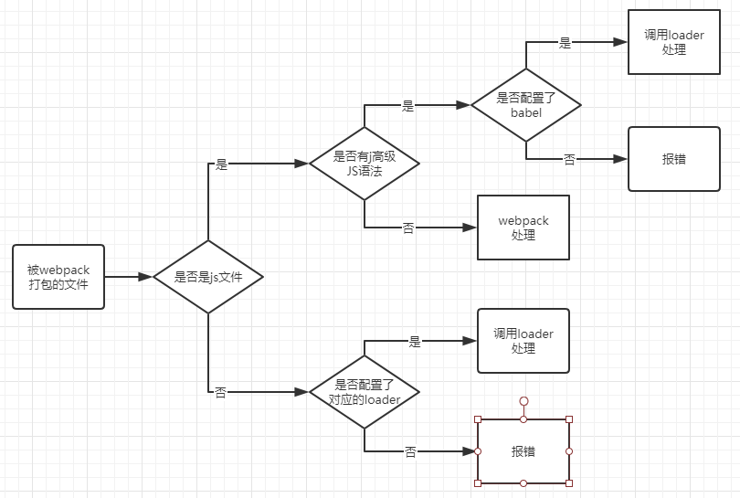

webpack，前端工程化的解决方案。

代码压缩、处理浏览器端对 JavaScript 的兼容

<!-- more -->

# 基本使用

在使用 webpack 之前，先 `npm init` 生成 _package.json_ 文件
然后安装 webpack 和 webpack-cli，`npm install webpack webpack-cli -D`

- 这里`-D`或者`--save--dev`表示将包记录在`package.json`中的`devDependencies`（仅在开发阶段用到）节点下
- `-S`或者`--save`表示记录在`dependencies` (开发阶段和部署阶段都要用到) 节点下

> 用`-S`或`-D`在 npm 官网可以看到。这两个参数可以在包名前，也可在包名后

在根目录创建配置文件 _webpack.config.js_ ，初始话配置文件

```javascript
module.exports = {
  mode: "development",
};
```

- 其中 _mode_ 用来指定导报模式 _development_ 模式不会压缩代码，_production_ 模式则会压缩代码。所以前者适用于开发模式，后者适用于发布上线

在 package.json 配置文件中的 _script_ 节点下增加 _dev_ 脚本

```json
"scripts": {
    "dev": "webpack"
}
```

- `dev`：随便取。`webpack`：要执行的动作，字符串的形式

_scripts_ 节点下的脚本，可以使用 **npm run** 来执行。比如这里是

```shell
npm run dev
```

这样一个简单的 webpack 打包就完成了，打包默认生成的文件是 `main.js`

> 在运行`npm run dev`之前，会先读取`webpack.config.js`里面的配置内容

## 配置

### 入口出口配置

默认入口文件位置是**./src/**，出口**./dis/**

配置打包的入口和出口。在 _webpack.config.js_ 中

```javascript
const path = require("path");
module.exports = {
  /* ... */
  entry: path.join(__dirname, "要打包的文件路径及文件"),
  output: {
    path: path.join(__dirname, "./dist"), // 文件输出路径
    filename: "bundle.js", // 输出的文件名（不是固定名称）
  },
};
```

### 自动打包

webpack 自动打包，修改后保存，自动刷新文件，比如 css。安装自动打包工具

```shell
npm install webpack-dev-server -D
```

> 这个插件生成的`bundle.js`不在磁盘上，而是在内存上，所以看不到，可以在浏览器输入 url 查看。要引用，在 HTML 文件中`<script src="./bundle.js"></script>`

在 _webpack.config.js_ 中

```javascript
devServer: {
   open: true,
   host: '127.0.0.1',
   port: 8080
}
```

在 _package.json_ 中

```json
"dev": "webpack server"
```

或者：

- `--open` 表示打包创建服务器后自动打开浏览器。

- `--host` 配置 IP 地址

- `--port` 配置端口

> "webpack-dev-server --open --host 127.0.0.1 --port 8080"

### 其他

上面配置后，浏览器打开对应 url 和端口后，得到的是一个文件路径，一下配置打开浏览器后默认显示的页面（复制页面到根目录）

此外，这个插件会**自动**在入口的*index.html*中的`<head>`里面插入`<script defer src="bundle.js"></script>`

- `npm install html-webpack-plugin -D` 安装生成预览页面的插件。

- 在 _webpack.config.js_ 文件中

```javascript
const HtmlWebpackPlugin = require("html-webpack-plugin");
const htmlPlugin = new HtmlWebpackPlugin({
  template: "./src/index.html",
  filename: "./index.html", // 该文件生成在内存中，在目录不会显示出来
});
```

- 在 _webpack.config.js_ 的暴露中添加配置节点

```javascript
module.exports = {
  /* ... */
  plugins: [htmlPlugin],
};
```

> _plugins_ 数组是 _webpack_ 打包期间会用到的一些插件列表

浏览器中展示的页面不是*src*下的文件，而是内存中的文件

## webpack 中的加载器

- webpack 默认只能处理 `.js` 结尾的模块，要打包其他类型的文件，需要调用 `loader` 加载器

webpack 打包处理过程：



**打包 _css_ 文件**

安装 _css_ 文件 loader

```shell
npm install style-loader css-loader -D
```

在 _webpack.config.js_ 中的 _module_ 中 配置 _rules_，添加匹配规则

```javascript
module: {
  rules: [{ test: /\.css$/, use: ["style-loader", "css-loader"] }];
}
```

- test 标识文件类型，use 标识要使用的 loader
- loader 是**有顺序的**，从右往左，是依赖关系

**打包 _less_ 文件**

- `npm install less-loader -D`

```javascript
module: {
  rules: [
    { test: /\.less$/, use: ["style-loader", "css-loader", "less-loader"] },
  ];
}
```

> 注意，使用 _less_ 之前要先安装 less。`npm install less` > _less-loader_ 要依赖于 _css-loader_

_less_ 的格式：

```less
body {
  background-color: darkcyan;
  ul {
    font-size: 23px;
  }
}
```

**打包处理 _scss_ 文件**

- `npm install sass-loader node-sass -D` ，安装的时候是 _sass_，但后缀名是 _scss_

```javascript
module: {
  rules: [
    { test: /\.scss$/, use: ["style-loader", "css-loader", "scss-loader"] },
  ];
}
```

**配置 _postCSS_ 自动添加 css 的浏览器兼容前缀**

- `npm i postcss-loader autoprefixer -D`
- 根目录创建 `postcss.config.js` 文件，配置：

```javascript
const autoprefixer = require("autoprefixer");
module.exports = {
  plugins: [autoprefixer], // 挂载插件
};
```

在 _webpack.config.js_ 中添加匹配规则，依赖于 css：

```javascript
module: {
  rules: [
    { test: /\.scss$/, use: ["style-loader", "css-loader", "postcss-loader"] },
  ];
}
```

**打包图片和字体**

- `npm i url-loader file-loader -D`
- 在 _webpack.config.js_ 中添加匹配规则:

```javascript
module: {
  rules: [
    { test: /\.jpg|png|gif|bmp|ttf|svg$/, use: "url-loader?limit=10000" },
  ];
}
```

- 这里不需要其他的 loader 支持，所以不用引入。一个值时可以吧数组去掉，`?` 之后是 loader 的参数， _limit_ 指定图片的大小，单位是字节，当张片小于 limit 的时候，图片会被转化 wei `base64`，（图片 url 改变了）

**打包处理 js 中的高级语法**

- 安装 `babel` 转换器相关的包：`npm i babel-loader @babel/core @babel/plugin-proposal-decorators -D`
- 在根目录创建 _babel_ 配置文件 `babel.config.js`，配置：

```javascript
module.exports = {
  plugins: [["@babel/plugin-proposal-decrators", { legacy: true }]],
};
```

- 在 _webpack.config.js_ 中，添加 loader 规则：

```javascript
{test: /\.js$/, use: "babel-loader", exclude: /node_modules/}
```

- _exclude_ 表示在 _babel-loader_ 处理的时候要排除的文件

> 对应不同的插件配置不同，去 babel 的官方文档查看

**webpack 中使用 Vue**

- `$ npm install vue -S`
- 在入口文件 `index.js` 中，**import Vue from "vue"** 导入 Vue
- 创建 vue 实例对象
- 组件中要有一个根组件，**App.vue**
- 使用 `render` 函数渲染 APP 根组件

```javascript
import Vue from "vue";
import App from "./components/App.vue";
const vm = new Vue({
  el: "#app",
  render: (h) => h(App),
});
```

- App.vue 和其路径是根据情况而定
- webpack 打包 vue，使用 **render** 函数渲染，在局部中不使用 **components**，这是因为 webpack 中导入的 vue 不是完整的 vue

> `render` 函数：

**webpack 配置 Vue 单文件组件 loader**

- `npm i vue-loader vue-template-compiler -D`
- 在 _webpack.config.js_ 中，添加 loader 规则：

```javascript
const VueLoaderPlugin = require("vue-loader/lib/plugin");
module.exports = {
  module: {
    rules: [{ test: /\.vue$/, loader: "vue-loader" }],
  },
  plugins: [new VueLoaderPlugin()],
};
```

# webpack 打包发布

上线之前要通过 webpack 将应用进行整体打包（从内存到磁盘），在 **package.json** 中:

```json
"scripts": {
    "build": "webpack --mode production"
}
```

## 整理文件

- 将文件分类保存

在 _webpack.config.js_ 中

```js
output: {
    path: path.join(__dirname, "dist"),
    filename: 'js/bundle.js'
}
```

图片存放位置配置，在处理图片的`loader`中

```js
{
    test: /\.jpg|png|gif|bmp|ttf|svg$/, use: "url-loader?limit=10000&outputPath=image"
},
```

其他：

自动清除`dist`文件夹，在 npm 查找插件`clean-webpack-plugin`，按照文档匹配

# source map

- 解决打包后代码所处行和源代码所处行的位置信息不一致

在**开发时**，修改 webpack 的配置文件，加入`devtool: 'eval-source-map'`，浏览器出现的报错行数和现实开发中的行数是对应的。

在**发布后**，要取消这个功能，打包后的文件只有一行，不会对应到在哪行出错，处于安全性考虑

**只标记行号**，不暴露源代码，修改为`devtool: 'nosource-source-map'`

# 其他

实际开发过程中很少会手动配置 webpack ，一般会通过其他的脚手架生成。

可用`@`代替`src`，添加配置

```js
resolve: {
    alias: {
        '@': path.join(__dirname, './src')
    }
}
```
